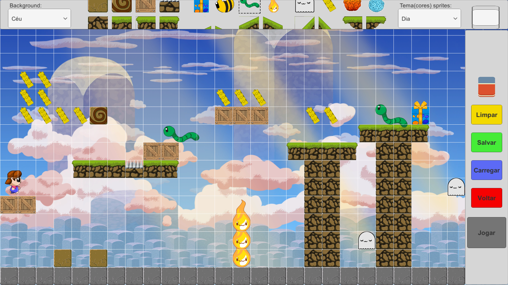

# 🎮 Sophia's Journey – 2D Mobile Game (Graduation Project)

This repository contains the final build of **Sophia's Journey**, a 2D platformer game developed as a **Graduation Project** for the **Game Development** program at FATEC Carapicuíba, Brazil.

---

## 📌 Project Overview

**Sophia's Journey** is a 2D mobile platformer inspired by *Super Mario Maker*, designed to be accessible and encourage players to explore **game and level design** concepts without needing technical knowledge. 

Players can **create and edit their own levels**, customizing enemy positions, obstacles, and paths in a simple, intuitive way.

The game takes place in the **dream world** of the protagonist, a 12-year-old girl named Sophia. The setting and story aim to metaphorically reinforce the idea of **chasing one’s dreams**.

---

## 🎯 Game Philosophy

1. Promote **game and level design** concepts through core gameplay.
2. Use the **dream world** as a metaphor to express creativity and ambition.
3. Inspired by *Super Mario Maker* and Nintendo's legacy of innovation and user-generated content.

---

## 🧠 Gameplay Summary

- Genre: 2D Platformer with a Level Editor.
- Playable character: **Sophia**, a young girl.
- Players can edit levels using a **grid-based system**, placing obstacles, enemies, and designing new paths.
- Main goal: reach the end of each level by overcoming challenges—created either by the developers or the player themselves.

---

## 🌍 Setting

The game takes place **inside Sophia’s dreams**. She follows the trail of a large white bird across a surreal landscape, ultimately aiming to reach a peaceful beach where a giant nest rests above the sea. The dreamscape is shaped by her subconscious and imagination.

---

## 🧰 Technologies Used

- Unity 5.4
- C#
- Adobe Photoshop
- Adobe Illustrator

---

## 👥 Target Audience

- Designed primarily for **mobile devices**.
- Intended for **young players (ages 12–15)** to stimulate **creativity** and early exposure to game design principles.
- Also aimed at general audiences who enjoy simple, creative 2D platformers.

---

## 🆚 Inspiration vs. Innovation

| Inspiration: Super Mario Maker | Sophia |
|-------------------------------|--------|
| Male character | Female, child protagonist |
| Complex editor | Simplified editor for younger users |
| Generic fantasy world | Original dream world with narrative meaning |

---

## 🎮 How to Play (PC Build)

> ⚠️ This is a Windows executable build for demo purposes only.

1. Open the `Build/` folder.
2. Run `Sophia.exe`.
3. Enjoy!

If you receive any antivirus warnings, please allow the app manually. This is a verified Unity build.

---

## 📸 Screenshots / Demo

### Main Gameplay
▶️ [Gameplay on YouTube](https://youtu.be/spkaaFAsJJ8)

### Level Editor

---

## 📥 Alternative Download

If you encounter any issues with GitHub’s download limits, use the following link:

🔗 [Download via Google Drive](https://drive.google.com/file/d/1_-Y_XCuHLsu88YGrdo18Et13YDBeAwyE/view?usp=sharing)

---

## 👨‍💻 Development Team

- **Guilherme Jefferson Ribeiro de Almeida** – Game Designer, QA, Development  
- **Jefferson de Oliveira Batista** – Programmer  
- **Felipe Batista Garcia** – Programmer  
- **Maiara Oliveira de Jesus** – Programmer  
- **Michel D’agola** – Artist  
- **Renan Borges Sousa** – Artist  
- **Vitor Hideki Takaki** – Market Researcher & Documentation

---

## ⚠️ License & Notice

This build is for demonstration purposes only.  
The full source code is not publicly available as the project was developed collaboratively with other team members. Redistribution or commercial use is not permitted without permission.

---

**Developed as part of the final coursework for the Game Development program at [FATEC Carapicuíba](https://fateccarapicuiba.cps.sp.gov.br/).**
